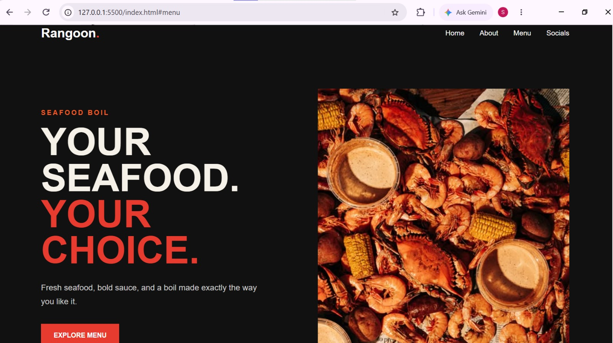
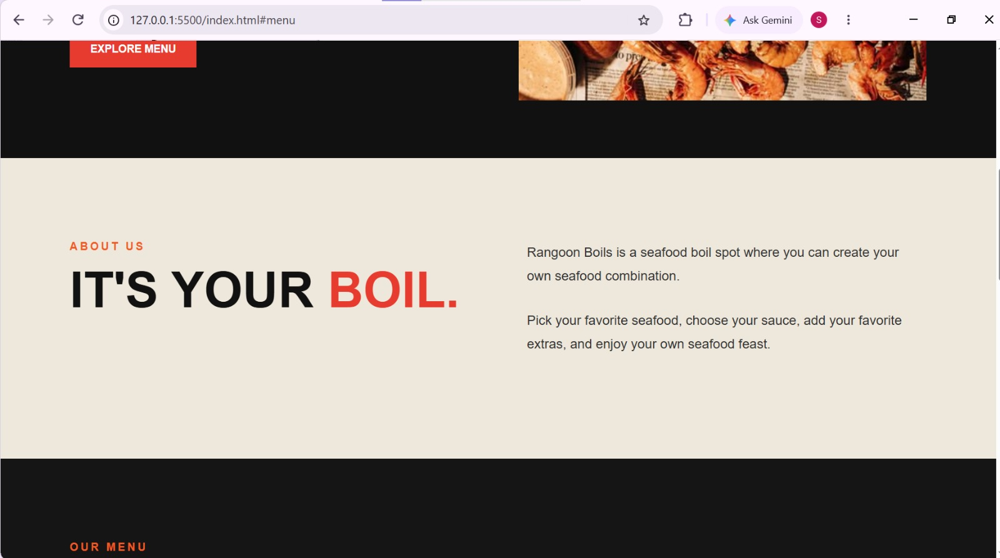
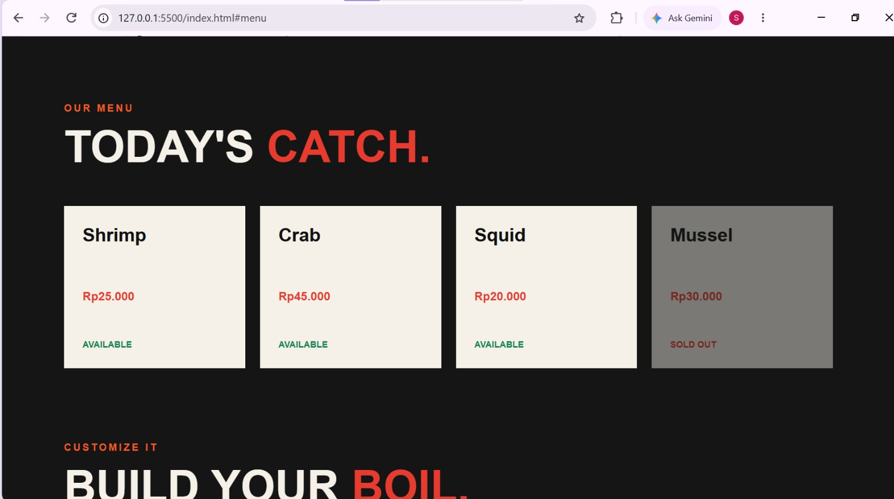
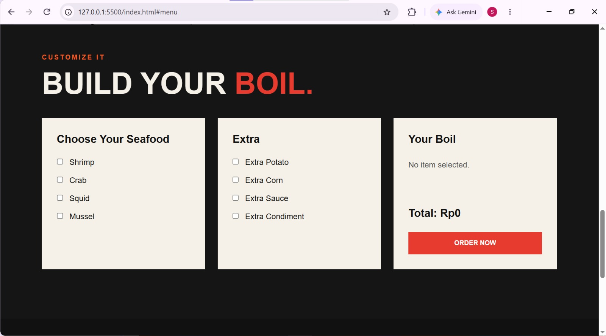
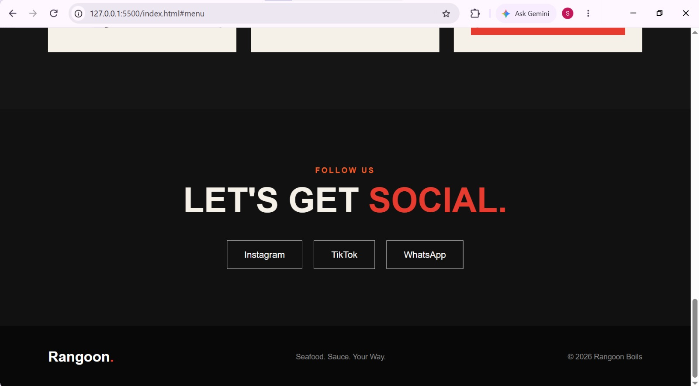
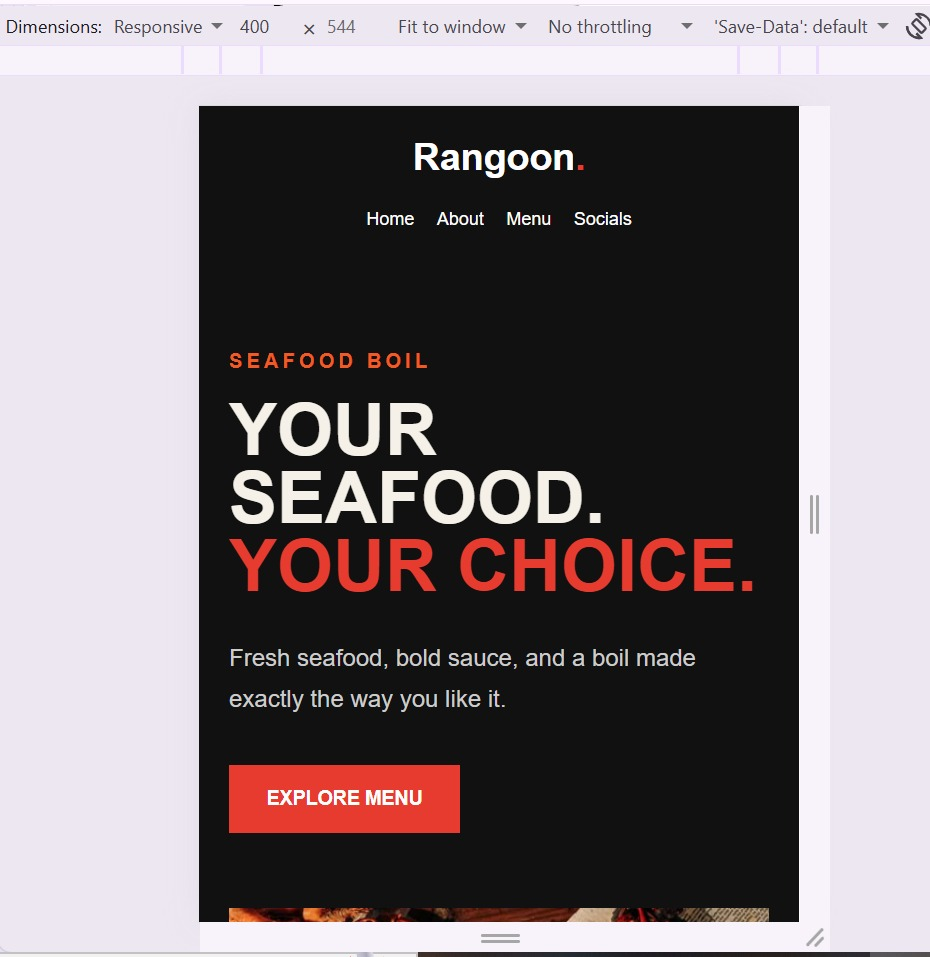

# Rangoon Boils

Rangoon Boils merupakan landing page website untuk usaha seafood boil. Website ini dibuat menggunakan HTML, CSS, dan JavaScript serta menggunakan Plain CSS untuk mengatur tampilan dan responsive design.

## 1. Home

Bagian Home merupakan halaman utama dari website Rangoon Boils. Pada bagian ini terdapat navbar yang digunakan untuk berpindah ke beberapa bagian website, seperti Home, About, Menu, dan Socials. Bagian utama menampilkan nama dan konsep Rangoon Boils melalui teks "Your Seafood. Your Choice.", deskripsi singkat, gambar seafood boil, serta tombol Explore Menu yang mengarahkan pengguna ke bagian Menu.

## 2. About

Bagian About berisi informasi singkat mengenai Rangoon Boils. Pada bagian ini dijelaskan bahwa Rangoon Boils menyediakan seafood boil yang dapat disesuaikan oleh pengguna. Pengguna dapat memilih kombinasi seafood, sauce, dan tambahan sesuai dengan keinginan mereka.

## 3. Menu

Bagian Menu menampilkan Today's Catch, yaitu pilihan seafood yang tersedia pada website. Setiap pilihan menampilkan nama seafood, harga, dan status ketersediaannya. Data menu seafood ditampilkan menggunakan JavaScript melalui DOM, sehingga card seafood dibuat secara dinamis pada halaman website.

## 4. Build Your Boil

Bagian Build Your Boil digunakan untuk melakukan kustomisasi pesanan. Pengguna dapat memilih beberapa jenis seafood seperti shrimp, crab, squid, dan mussel, serta memilih tambahan seperti Extra Potato, Extra Corn, Extra Sauce, dan Extra Condiment. JavaScript digunakan untuk membaca pilihan checkbox pengguna, menghitung total harga, dan menampilkan daftar item yang dipilih pada bagian Your Boil.

## 5. Socials

Bagian Socials digunakan untuk menyediakan akses ke media sosial Rangoon Boils. Terdapat beberapa pilihan seperti Instagram, TikTok, dan WhatsApp yang dapat digunakan pengguna untuk mendapatkan informasi lebih lanjut atau melakukan pemesanan melalui media sosial.

## 6. Responsive

Website Rangoon Boils dibuat responsive agar dapat menyesuaikan tampilan dengan ukuran layar yang berbeda. Pada tampilan desktop, beberapa elemen ditampilkan dalam beberapa kolom, sedangkan pada ukuran tablet dan mobile layout akan menyesuaikan menggunakan CSS media query. Hal ini membuat website tetap dapat digunakan dengan nyaman pada perangkat desktop maupun mobile.

## Teknologi yang Digunakan

- HTML
- CSS
- JavaScript
- Plain CSS
- DOM

## Fitur Utama

- Responsive design untuk desktop, tablet, dan mobile
- Navigasi antar-section
- Tampilan menu seafood
- Status seafood available dan sold out
- Customization seafood dan extra
- Perhitungan total harga menggunakan JavaScript
- Link ke social media
